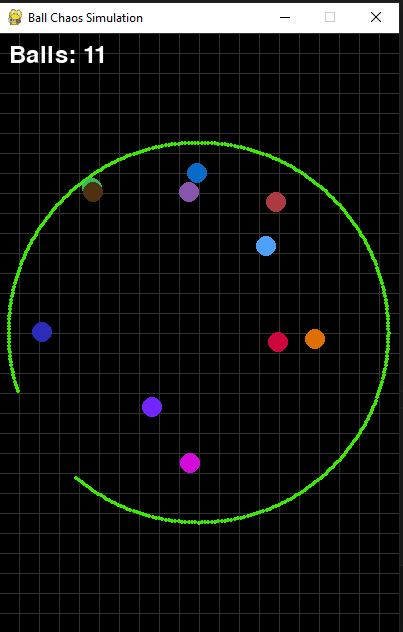

# Ball Chaos Simulation

This project is a ball simulation game using Pygame, where balls bounce within a rotating circular boundary with a gap. Balls can escape through the gap, and new balls are generated upon escape.



## Features

- Balls bounce within a circular boundary.
- Balls can escape through a rotating gap in the boundary.
- Gravity affects the balls' movement.
- Balls bounce off each other when they collide.
- The number of balls is displayed on the screen.

## Installation

1. **Clone the repository:**
    ```sh
    git clone https://github.com/khalilo2ya/balls_circle
    cd balls_circle
    ```

2. **Install dependencies:**
    Make sure you have Python and Pygame installed. You can install Pygame using pip:
    ```sh
    pip install pygame
    ```

3. **Add Sound Files:**
    Ensure you have the following sound files in a `sounds` directory:
    - `boundary_touch.wav`
    - `escape.wav`

## Running the Simulation

1. **Run the script:**
    ```sh
    python circle_gap_rotate_sound.py
    ```

2. **Control the simulation:**
    - The balls will bounce within the circle and escape through the rotating gap.
    - The simulation will display the current number of balls on the screen.

## Capture Image

To capture an image of the simulation screen, add the following code snippet to the main loop in `ball_simulation.py`:

```python
# Capture the screen and save as image
pygame.image.save(screen, "capture.jpg")
```

Place this snippet inside the main loop, just before the `pygame.display.flip()` call.

## Code Overview

### Ball Class

The `Ball` class handles the properties and behavior of the balls, including movement, collision detection with the boundary, and drawing on the screen.

### Collision Detection

The `check_collision` function detects and handles collisions between balls, updating their velocities accordingly.

### Main Loop

The main loop handles:
- Screen updates
- Drawing the grid and boundary
- Updating ball positions
- Checking for collisions
- Displaying the ball count

